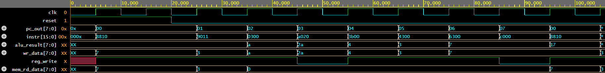

# 8-Bit RISC Microprocessor in Verilog

A simple 8-bit RISC-style processor written in Verilog HDL and verified in simulation with testbenches and waveform inspection. This is an educational project, developed with the help of an AI coding assistant.

## Architecture

The design is split into modular blocks:

| Module | File | Purpose |
|--------|------|---------|
| ALU | `src/alu.v` | Arithmetic and logic operations |
| Register File | `src/register_file.v` | General-purpose registers |
| Program Counter | `src/pc.v` | Tracks the address of the next instruction |
| Memory | `src/memory.v` | Instruction/data memory |
| Control Unit | `src/control_unit.v` | Decodes instructions and generates control signals |
| Top Level | `src/top.v` | Connects all modules into the complete CPU |

## Project Structure

```
programs/   Test program in hex format, loaded into memory
src/        Verilog design files
tb/         Testbenches (alu_tb.v, top_tb.v)
docs/       Waveform screenshots
simulate.sh Script to compile and run the simulation
```

## Instruction Set

| Opcode | Mnemonic | Description |
|--------|----------|-------------|
| [xxxx] | [ADD]    | [description] |
| ...    | ...      | ... |

## How to Run the Simulation

Requirements: [Icarus Verilog](http://iverilog.icarus.com/) and GTKWave.

```bash
chmod +x simulate.sh
./simulate.sh
```

On Windows, run this in Git Bash or WSL. To view waveforms, open the generated `.vcd` file in GTKWave.

To run the ALU testbench on its own:

```bash
iverilog -o alu_sim src/alu.v tb/alu_tb.v
vvp alu_sim
```

## Waveform



## Status

- Simulated and checked in waveforms
- Not yet synthesized or tested on FPGA hardware

## Disclaimer

This is a learning project. It may contain bugs or limitations and is not intended for production use.

## License

MIT License. See [LICENSE](LICENSE).
